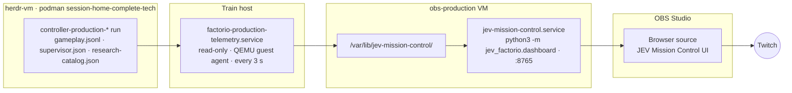

<p align="center"></p>

<div align="center">

# JEV Factorio Mission Control

**The live OBS broadcast overlay for the JEV AI Factorio stream —
captured exactly as deployed, and traced back to its source.**

[](https://github.com/CompleteDotTech/jev-factorio-agent/commit/761ffc8)
[](https://github.com/CompleteDotTech/jev-factorio-agent)
[](#the-current-run)
[](#running-the-overlay-locally)

<br>


*The full program output as streamed (scene **JEV Mission Control**, 1920×1080), captured from
OBS on 2026-09-28 00:33Z with `761ffc8` deployed and the fresh Factorio 2.0.77 game running.
The game video fills the center **OBS COMPOSITION** area. The top bar shows the game's research
tree progress and **RUN TIME** counting up from this run's start. The **Current objective** tree
on the left combines verified controller goals and research milestones.*

</div>

---

## What this repository is

This is a **snapshot of a live deployment**, not an actively developed source tree. Every path
mirrors the live filesystem it was captured from: `obs-production/` is the OBS VM
(`/etc`, `/opt`, `/home/ubuntu`), and `train/` is the Train host (`~completetrain`). Code changes
happen upstream in [`CompleteDotTech/jev-factorio-agent`](https://github.com/CompleteDotTech/jev-factorio-agent)
(`src/jev_factorio/`); this repo records **what is actually deployed and where it came from**.

The current deployment is jev-factorio-agent
[`761ffc8`](https://github.com/CompleteDotTech/jev-factorio-agent/commit/761ffc8),
live since **2026-09-27 02:09Z**.

## Where everything came from

| Layer | Location on the live system | In this repo |
| --- | --- | --- |
| Overlay web app (package `jev_factorio/`) | `obs-production` VM, `/opt/jev-mission-control/jev_factorio/` | [`obs-production/opt/jev-mission-control/jev_factorio/`](obs-production/opt/jev-mission-control/jev_factorio/) |
| Item icons (`--icon-dir`) | `/opt/jev-mission-control/icons/`, copied from Factorio 1.1.110 `data/base/graphics/icons` | **Not included** — these are Wube game assets |
| Overlay service (`127.0.0.1:8765`) | `/etc/systemd/system/jev-mission-control.service` | [`obs-production/etc/systemd/system/`](obs-production/etc/systemd/system/) |
| OBS scene collection `STS2`, scene **JEV Mission Control** | `~ubuntu/.config/obs-studio/basic/scenes/STS2.json` | [`obs-production/home/ubuntu/.config/...`](obs-production/home/ubuntu/.config/obs-studio/basic/scenes/) (SRT passphrases redacted) |
| OBS Lua scripts, media sources, relay, maintenance art | `~ubuntu/jev-obs/` | [`obs-production/home/ubuntu/jev-obs/`](obs-production/home/ubuntu/jev-obs/) |
| Telemetry mirror (controller → OBS VM, every 3 s) | Train host, `~completetrain/factorio-controller-replacement/` + user systemd unit | [`train/`](train/) |
| Generated art | see above | [`art/`](art/) |

The OBS browser source loads `http://127.0.0.1:8765/?studio=1&v=d02486c`. OBS draws that page
over the native game video source, which sits under the transparent **OBS COMPOSITION** area.
After a deploy, reload the page with the source's **Refresh** button in OBS: the server sends
`no-store`, but a page that is already running keeps its old scripts until it reloads.

## How the data flows



The mirror copies `gameplay.jsonl` and `supervisor.json` every 3 seconds, and
`research-catalog.json` — the game's technology tree — only when that file changes. The
dashboard is **read-only**: it redacts credential-like keys and values before rendering, and it
doesn't call models or control the game.

### The current run

The fresh Factorio **2.0.77** game uses telemetry session `cbd0e71ffc1d46788a97846273b275e5`.
Its 48-hour run began at **2026-09-27 23:45Z** and is scheduled to end at **2026-09-29 23:45Z**.
The tracked `campaign.conf` records the session selected by the live Train telemetry service.
The research sidecar is generated runtime data and is not stored in this snapshot.

## Running the overlay locally

No build step, no dependencies — the dashboard uses only the Python standard library.

```bash
cd obs-production/opt/jev-mission-control
python3 -m jev_factorio.dashboard \
  --log-file gameplay.jsonl --supervisor-state supervisor.json --port 8765 \
  [--icon-dir /path/to/Factorio/data/base/graphics/icons]
```

Then open **`http://127.0.0.1:8765/?studio=1`** (the 1920×1080 studio layout OBS uses) or
**`/?overlay=1`**. A missing log file is fine; the page shows its "awaiting evidence" state.
Without `--icon-dir`, inventory slots and events show item names instead of icons.

## Deployment record

`jev_factorio/DEPLOYED_COMMIT` records the deployed commit on the VM. The unit runs
`python3 -m jev_factorio.dashboard ... --icon-dir /opt/jev-mission-control/icons`.

**Current, from 2026-09-27 02:09Z:** `jev_factorio/` is an exact copy of
`src/jev_factorio/{__init__,dashboard,dashboard_mission,research_catalog}.py` and
`dashboard_assets/` at
[`761ffc8`](https://github.com/CompleteDotTech/jev-factorio-agent/commit/761ffc8).
It adds four PRs to `16ab385`:

| PR | What it changed |
| --- | --- |
| **#104** | The objective tree shows 11 milestones instead of three fixed goals. The controller's goals keep their verified ticks. Base-game research on the way to the rocket (steam power, the science packs, oil processing, the rocket silo) shows the tick it was first seen. Research already done when the dashboard started watching shows as "Researched", with no tick. |
| **#105** | Milestone names never clip in the OBS browser source. |
| **#106** | The top bar shows **RUN TIME** where it used to show the **CAMPAIGN CUTOFF** countdown. It counts up from the supervisor's `started_at` and stops at the cutoff. |
| **#109** | Shows where the run is on the game's own research tree, for Factorio 1.1, 2.0.x and Space Age. A top-bar research strip shows the current research, done/total technologies per science pack, and the count to the goal. The objective milestones come from the tree. The tree arrives as a `research-catalog.json` sidecar that the controller writes at startup and the telemetry mirror copies over (see [data flow](#how-the-data-flows)). The pinned production controller (`f89407d`) predates the exporter; for the fresh game started at 2026-09-27 23:45Z, a one-time read-only export from the same upstream code was placed in the run's supervision directory. The strip is now visible; controller telemetry supplies current research progress. A new world, game version, or mod set needs a fresh export until the controller is updated. |

<details>
<summary><strong>Earlier deployments and rollback copies</strong></summary>

<br>

Each deploy's rollback copy is in `theme-backups/`:

| Rollback copy | Commit | Live |
| --- | --- | --- |
| `20260927T020935Z-pre-761ffc8/` | `1eb7e1d` | 2026-09-27 00:52Z → 02:09Z |
| `20260927T005157Z-pre-1eb7e1d/` | `6424661` | 2026-09-26 23:43Z → 2026-09-27 00:52Z |
| `20260926T234310Z-pre-6424661/` | `c454af6` (PR #104 only) | 2026-09-26 23:37Z → 23:43Z |
| `20260926T233716Z-pre-c454af6/` | `16ab385` | 2026-09-26 12:10Z → 23:37Z |
| `20260926T120921Z-pre-16ab385/` | — | before 2026-09-26 12:10Z |

**`16ab385`, 2026-09-26 12:10Z to 23:37Z:** added PR #86 (item icons, plain-language events,
a pending-check indicator, and clearer observations and workflow) and PR #88 (a one-line
readiness panel in the studio layout).

**Previous, 2026-09-23 to 2026-09-26:** the flat `dashboard.py` and `dashboard_assets/` at the
top of `/opt/jev-mission-control/` are still on disk but no longer served. Each deployed file
was hashed and matched to the upstream repo's history
(`src/jev_factorio/dashboard.py` and `dashboard_assets/`):

- `dashboard.py`, `app.js`, `index.html` and `factory-steel.png` are byte-identical to commit
  [`d02486c`](https://github.com/CompleteDotTech/jev-factorio-agent/commit/d02486c3612381927bd77c443c49f3bd8d3f5231)
  ("Hide scrollbar chrome in OBS dashboard compositions", 2026-09-23).
- `styles.css` has the same rules as `d02486c`, but the scrollbar-hiding block is appended at
  the end of the file instead of sitting mid-file. It was hot-patched before that commit.
- `*.before-studio-*` and `theme-backups/` are the deployment's own rollback copies. They match
  earlier upstream commits: PR #25 `ba9d71a`, `1545b62`, `b3cd8a6` and `00b1c97`.
- `mission_control.py` and `mission_control_web/` are the original PR #25 Mission Control app.
  They are still on disk but no longer serve the stream.

The previous deployment did not include PR #68's launch-readiness panel or
`mission.js`/`mission.css`. Every deployment since `16ab385` does.

</details>

## Screenshots & generated art

<div align="center">

| Live program output | Offline / maintenance slate |
| :---: | :---: |
| [](art/jev-mission-control-overlay-live.png) | [](art/jev-factorio-maintenance-v1.png) |
| Scene **JEV Mission Control** as streamed,<br>1920×1080, captured 2026-09-28 00:33Z | OBS scene **JEV - Maintenance**,<br>driven by `obs-maintenance-scene.lua` |

<br>

[](art/factory-steel.png)

*`factory-steel.png` — the dashboard's tiling background texture, served from
`dashboard_assets/`.*

</div>

All three images live in [`art/`](art/), with each one's purpose, size, deploy location and
exact generation prompt recorded in [`art/README.md`](art/README.md).

## Redactions

The SRT listener passphrases in `STS2.json`, `jev-obs/media.json` and
`jev-obs/factorio-b-media.json` are replaced with `REDACTED`. None of these files contains a
stream key or Twitch token; the relay and metadata scripts read those at runtime from the live
OBS profile and browser cookie store. Recordings, runtime status files and backups of the OBS
profile are not included. The only screenshot is the program-output capture shown at the top of
this README.

---

<div align="center">
<sub>Factorio is a trademark of Wube Software. This project isn't affiliated with Wube.</sub>
</div>
